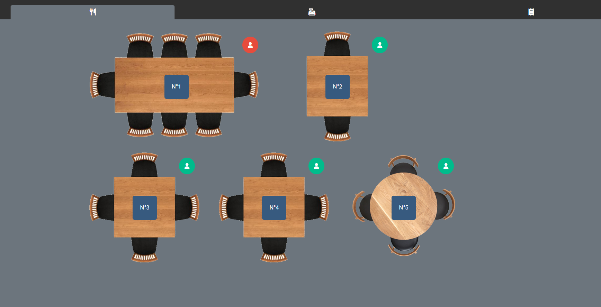
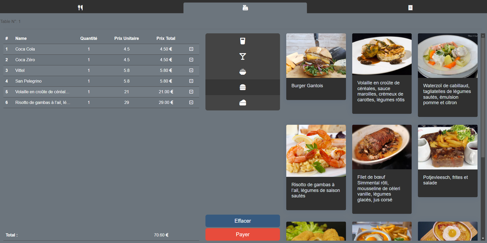
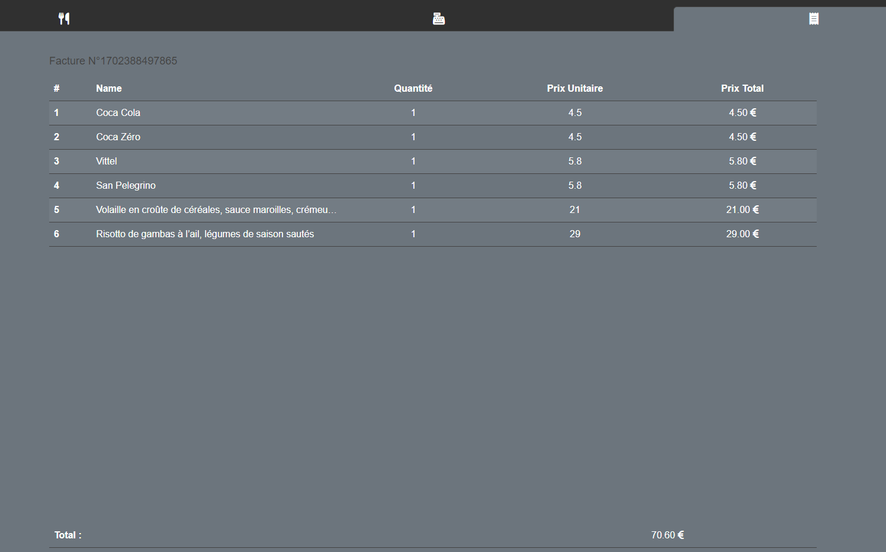

<p align="center">
  <a href="http://nestjs.com/" target="blank"></a>
</p>

[circleci-image]: https://img.shields.io/circleci/build/github/nestjs/nest/master?token=abc123def456
[circleci-url]: https://circleci.com/gh/nestjs/nest

  <p align="center">A progressive <a href="http://nodejs.org" target="_blank">Node.js</a> framework for building efficient and scalable server-side applications.</p>
    <p align="center">
<a href="https://www.npmjs.com/~nestjscore" target="_blank"></a>
<a href="https://www.npmjs.com/~nestjscore" target="_blank"></a>
<a href="https://www.npmjs.com/~nestjscore" target="_blank"></a>
<a href="https://circleci.com/gh/nestjs/nest" target="_blank"></a>
<a href="https://coveralls.io/github/nestjs/nest?branch=master" target="_blank"></a>
<a href="https://discord.gg/G7Qnnhy" target="_blank"></a>
<a href="https://opencollective.com/nest#backer" target="_blank"></a>
<a href="https://opencollective.com/nest#sponsor" target="_blank"></a>
  <a href="https://paypal.me/kamilmysliwiec" target="_blank"></a>
    <a href="https://opencollective.com/nest#sponsor"  target="_blank"></a>
  <a href="https://twitter.com/nestframework" target="_blank"></a>
</p>
  <!--[](https://opencollective.com/nest#backer)
  [](https://opencollective.com/nest#sponsor)-->

## Description

Framework utilisé: [Nest](https://github.com/nestjs/nest) et [Fastify](https://fastify.dev/)
Version de node: v18.18.0
Librairies: [Bootstrap](https://getbootstrap.com/) et [Handlebar](https://handlebarsjs.com/)

Ceci est un projet étudiant à destination des étudiants de [WebTech institute] (https://webtech.institute/). 
L'objectif est de mettre en place une base de données et de créer un schéma de données qui soit adapté au projet. La plateforme doit pouvoir tourner à l'identique, sauf que les données doivent persister dans le temps (même avec un arrêt/redémarrage du serveur).

## Installation

Il vaut mieux avoir nvm d'installer sur sa machine. Ensuite, faire les commandes suivantes

```bash
$ nvm use 18.18.0
$ npm install
```

Vous devez avoir une base de données mysql qui tourne sur le port 3306, avec les informations suivantes:
```bash
datebasename: cashier-exercice
username: root
password: root
```

Attention, tout le code pour se connecter à la bdd a été commenté.
Tout le code pour transformer un model en entité de bdd a été commenté.
Il faudra réactiver le code relatif à typeOrm et recoder les entités pour pouvoir faire la suite.

Ensuite, si le fichier de migration n'existe pas (/migrations/xxxxx-init.ts), il faut le générer:
```bash
$ npm run typeorm migration:generate ./migrations/Init -- -d ./config/ormconfig.ts
```
Ensuite, il faut éxécuter le fichier de migration afin qu'il créé les tables sur la bdd:
```bash
$ npm run typeorm migration:run -- -d ./config/ormconfig.ts
```

Faire tourner l'application crééra les données par défaut pour les produits et les tables

## Ce qui est attendu

Le minimum est que l'application puisse tourner mais toutes les données doivent venir de la bdd.
Pour aller plus loin, quelques idées:
 - le schéma des tables dans la salle n'existe pas. Actuellement chaque table connait sa position et est chargée tel quelle. Il serait bon de pouvoir charger des schémas de salle différent
 - avoir une table en bdd pour les catégories de produits
 - avoir différents moyens de paiment (cheque, carte bleu, monnaie), retrouvable sur la facture


## Running the app

```bash
# development
$ npm run start

# watch mode
$ npm run start:dev

# run lint
$ npm run lint
```

## Screenshoots







## Support

Nest is an MIT-licensed open source project. It can grow thanks to the sponsors and support by the amazing backers. If you'd like to join them, please [read more here](https://docs.nestjs.com/support).

## Stay in touch

- Author - [Kamil Myśliwiec](https://kamilmysliwiec.com)
- Website - [https://nestjs.com](https://nestjs.com/)
- Twitter - [@nestframework](https://twitter.com/nestframework)

## License

Nest is [MIT licensed](LICENSE).
